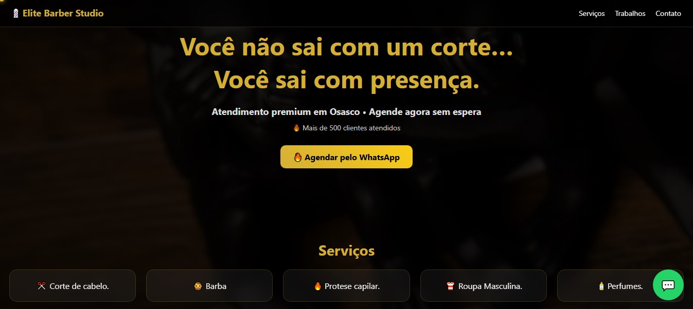
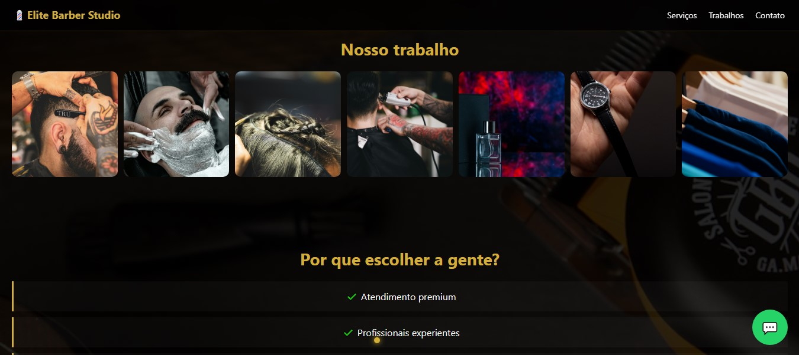

# 💈 Elite Barber Studio

Landing page moderna e responsiva para barbearia, desenvolvida com foco em **conversão de clientes**, **design premium** e **performance**.

---

## 🚀 Demonstração

🔗 Acesse o projeto online:
  https://barberstudioelite.netlify.app/

---

## 🎯 Objetivo

Criar uma página que:

* Gere agendamentos via WhatsApp
* Transmita profissionalismo e autoridade
* Tenha visual moderno (estilo iFood/Nubank)
* Seja rápida e totalmente responsiva

---

## ✨ Funcionalidades

* 💬 Botão direto para WhatsApp
* 📱 Layout 100% responsivo
* 🎯 CTA estratégico para conversão
* 🖼️ Galeria de imagens otimizada
* ⚡ Performance leve (imagens lazy loading)
* 🎨 Design moderno com efeito glass + dourado premium
* 🧭 Navegação simples e intuitiva
* 🖱️ Cursor personalizado (desktop)

---

## 🛠️ Tecnologias utilizadas

* HTML5
* CSS3 (Flexbox + Grid)
* JavaScript
* GSAP (animações)
* ScrollTrigger

---

## 📸 Preview do projeto

<!-- SUBSTITUA COM PRINTS -->




---

## 📂 Estrutura do projeto

```
📁 projeto-barbearia
 ├── index.html
 ├── styles.css
 ├── script.js
 ├── /img
```

---

## ⚙️ Como rodar o projeto

```bash
# Clone o repositório
git clone [https://github.com/seu-usuario/seu-repo.git](https://github.com/rafaelbarreto95/Elite-Baber-Studio)

# Acesse a pasta
cd seu-repo

# Abra o index.html no navegador
```

---

## 📈 Melhorias futuras

* Integração com sistema de agendamento
* Painel admin para horários
* Avaliações reais de clientes
* Integração com Google Maps customizado
* SEO avançado

---

## 📞 Contato

💬 WhatsApp:
<a>https://wa.me/5511983786374</a>

📍 Localização: Osasco - SP

---

## 🧠 Autor

Desenvolvido por Rafael Barreto 💻🔥
Se quiser um site como esse, entre em contato!

---

## ⭐ Dica

Se você gostou do projeto, deixa uma ⭐ no repositório!
